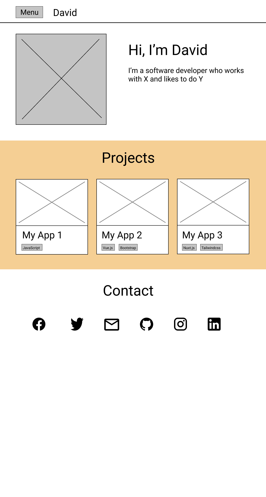

# Gridsome-Portfolio

My Portfolio made with Gridsome and ❤️

**Table of Contents**

1. [Instructions](#instructions)
1. [Tech Stack](#tech-stack)
1. [Mochups](#mockups)
1. [Design](#design)
1. [Roadmap](#roadmap)

## Instructions

To run it:

```
npm run develop
```

To build it:

```
npm run build
```

To explore: 😉

```
npm run explore
```

## Tech Stack

-   Gridsome.js
-   Vuetify

## Mockups



## Design

### Colors

\$white: #FDFDFC

\$light-orange: #FFD563

\$dark-orange: #F8B500

\$teal: #00ADB5

\$dark-blue: #0F1928
